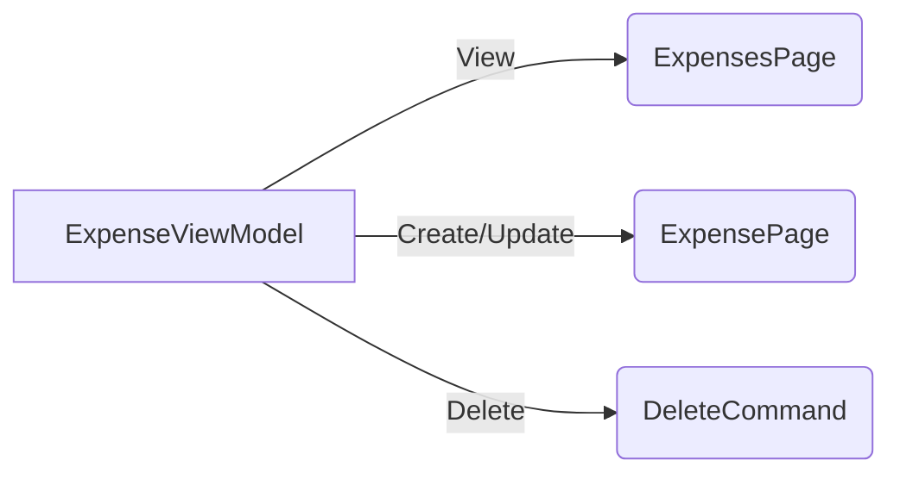

# .NET MAUI sample application 
This sample application is using the following features:
- MVVM
- Entity Framework SQLite
- Commanding
- Asynchronous operations
- CRUD

# MVVM Architecture

Both pages (list and detail) share the same view model.

